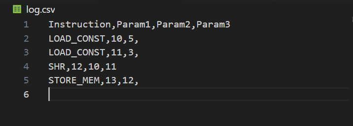
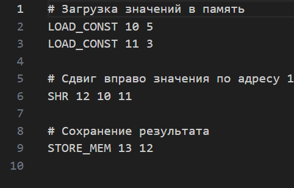
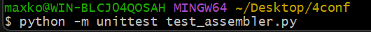
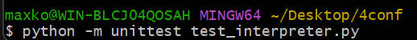
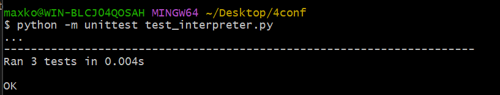
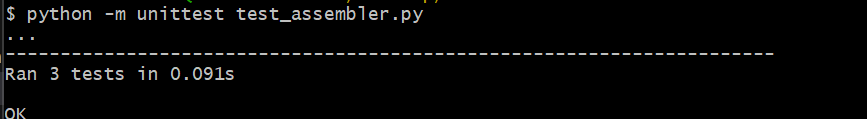

Система Ассемблера и Интерпретатора
Это проект, состоящий из двух частей:

Ассемблер — преобразует текстовый ассемблерный код в бинарный формат и генерирует лог в CSV.
Интерпретатор — выполняет бинарный файл, интерпретируя команды и изменяя содержимое памяти, а также сохраняет диапазон памяти в CSV файл.
Структура проекта
assembler.py — программа для преобразования ассемблерного кода в бинарный формат.
interpreter.py — программа для выполнения бинарного файла и вывода результатов в CSV.
output.bin — бинарный файл, сгенерированный из ассемблерного кода.
log.csv — CSV файл с логами выполнения команд ассемблера.
Установка
Убедитесь, что у вас установлен Python 3.6 или выше.
Клонируйте репозиторий или загрузите исходный код на вашу локальную машину.
Откройте терминал и перейдите в каталог с проектом.
Использование
1. Ассемблер
Чтобы преобразовать исходный ассемблерный код в бинарный файл, выполните команду:

bash
Копировать код
python assembler.py <output.bin> <log.csv>
Параметры:
<output.bin> — путь к бинарному файлу, который будет сгенерирован.
<log.csv> — путь к CSV файлу, в который будет записан лог с командой и её параметрами.
Пример:

bash
Копировать код
python assembler.py input.asm output.bin log.csv
2. Интерпретатор
Чтобы выполнить бинарный файл и сохранить содержимое памяти в CSV, выполните команду:

bash
Копировать код
python interpreter.py <input.bin> <output.csv> <mem_start> <mem_end>
Параметры:

<input.bin> — путь к бинарному файлу, который будет выполнен.
<output.csv> — путь к CSV файлу, в который будет записан диапазон памяти.
<mem_start> — начальный адрес диапазона памяти для записи.
<mem_end> — конечный адрес диапазона памяти для записи.
Пример:

bash
Копировать код
python interpreter.py output.bin output.csv 0 100
Этот пример выполнит бинарный файл output.bin, изменит память и запишет значения памяти с адресов от 0 до 100 в файл output.csv.

Команды Ассемблера
В ассемблерном коде можно использовать следующие команды:

LOAD_CONST — Загружает константу в память.

Пример: LOAD_CONST 201 836
Загружает константу 836 в память по адресу 201.
LOAD_MEM — Загружает данные из памяти по одному адресу в другой.

Пример: LOAD_MEM 100 200
Загружает данные из памяти по адресу 200 и сохраняет их в память по адресу 100.
STORE_MEM — Сохраняет данные из одного адреса в другой.

Пример: STORE_MEM 100 200
Сохраняет данные из памяти по адресу 200 в память по адресу 100.
SHR — Сдвигает данные по адресу.

Пример: SHR 100 200 50
Сдвигает данные из памяти по адресу 200 на количество, хранящееся по адресу 50, и сохраняет результат в память по адресу 100.
Формат бинарных данных
Каждая команда имеет свой формат:

LOAD_CONST: 6 байт

1 байт — opcode
2 байта — адрес в памяти (little-endian)
4 байта — значение константы (little-endian)
LOAD_MEM, STORE_MEM: 5 байт

1 байт — opcode
2 байта — первый адрес в памяти (little-endian)
2 байта — второй адрес в памяти (little-endian)
SHR: 7 байт

1 байт — opcode
2 байта — первый адрес в памяти (little-endian)
2 байта — второй адрес в памяти (little-endian)
2 байта — третий адрес в памяти (little-endian)
Пример работы
1. Ассемблер
Исходный ассемблерный код (input.asm):

Выполните команду для ассемблера:
bash
Копировать код
python assembler.py input.asm output.bin log.csv
2. Интерпретатор
Выполните интерпретатор:

bash
Копировать код
python interpreter.py output.bin output.csv 0 100
Это запишет значения памяти с адресов от 0 до 100 в файл output.csv.

Для выполнения тестов требуется ввести команды:

для ассемблера. 

для интепретатора.

Результаты тестирования:

